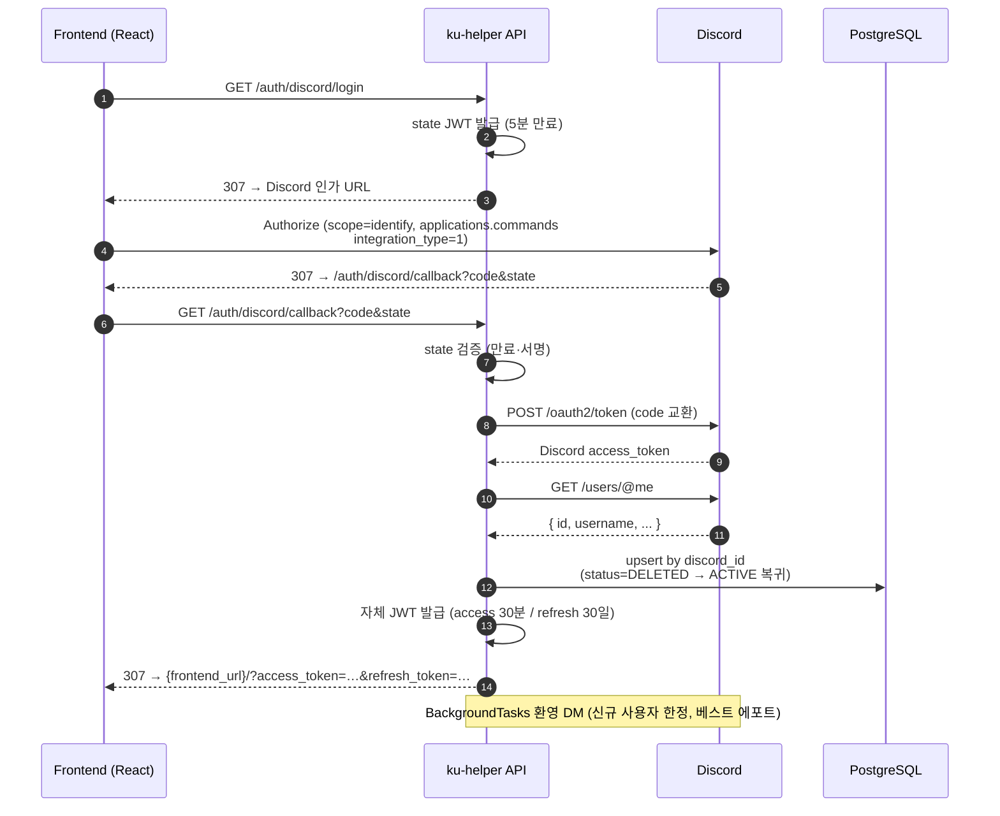

Discord OAuth2 Authorization Code Grant 의 콜백 단계. Discord 가 발급한 `code` 와 우리가 발급해 둔 `state` 를 검증한 뒤, Discord access token 교환 → 사용자 정보 조회 → DB upsert → 자체 JWT 발급 까지를 한 요청으로 처리하고, 프론트엔드로 토큰을 쿼리스트링에 실어 307 리다이렉트한다.

## 시퀀스

## 정책 메모

- **state 만료**: 5 분. 만료·서명 오류는 `INVALID_OAUTH_STATE` (401).
- **scope**: `identify`, `applications.commands` 두 개. `applications.commands` 는 user-install (`integration_type=1`) 을 자동 성립시켜 mutual guild 없는 사용자에게도 DM 발송이 가능하도록 한다 (Discord 에러 50278 회피).
- **`integration_type=1`**: 사용자 계정 설치 (USER_INSTALL). 길드 설치(0) 가 아니다.
- **탈퇴 후 재로그인**: `User.status == DELETED` 이던 동일 `discord_id` 가 다시 로그인하면 `UserRepository.upsert_by_discord_id` 가 `status` 를 `ACTIVE` 로 되돌리고 기존 레코드를 재사용한다. 이때 `is_new_user=False` 가 유지되어 환영 DM 이 재발송되지 않는다.
- **환영 DM**: `BackgroundTasks` 로 응답 종료 후 비동기 실행. 실패해도 로그인 흐름은 막지 않는다. Discord 봇 토큰으로 `POST /users/@me/channels` → `POST /channels/{id}/messages` 순서.
- **토큰 전달 방식**: 현재 query string. 보안적으로 fragment 또는 short-lived auth code → 토큰 교환 엔드포인트로의 전환은 추후 과제.

## 발생 가능한 에러

| HTTP | code | 의미 |
| --- | --- | --- |
| 401 | `INVALID_OAUTH_STATE` | `state` 값이 위조되었거나 5분 만료를 초과 |
| 502 | `DISCORD_TOKEN_EXCHANGE_FAILED` | Discord `/oauth2/token` 호출 실패 (네트워크·자격 증명 문제 포함) |
| 502 | `DISCORD_USER_FETCH_FAILED` | Discord `/users/@me` 호출 실패 |

응답 본문 포맷은 공통: `{"code": "<SCREAMING_SNAKE>", "detail": "<한국어 메시지>"}`.
